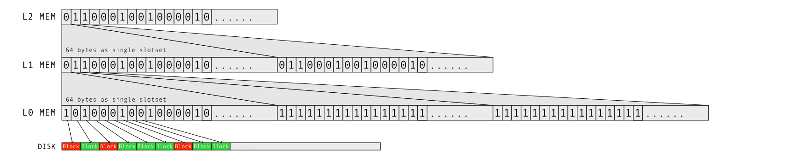

+++
title = "Ceph BlueStore 实现 - Allocator"
date = "2022-02-17"
categories = ["ceph","bluestore"]
image = "ceph.webp"
+++

### 背景

BlueStore 是 ceph 的新一代高性能 OSD 存储引擎用于取代以前的 FileStore。BlueStore 不像 FileStore 那样需要依赖文件系统而且选择绕过文件系统直接操作裸的块设备，可以对底层存储设备拥有更加精细的控制同时去掉了需要把对 RADOS 层的操作转换为 POSIX 语义的文件操作的过程也大大提高了性能。BlueStore 在设计时充分考虑了未来 SSD 的普及，而不在拘泥于 HDD。基于这样的考虑 BlueStore 在设计时可以一部分摒弃已有文件系统为了适配 HDD 而做的妥协（HDD随机读写速度远低于顺序读写，随机读写IOPS约120等），可以重复利用未来 SSD 的优势。

BlueStore 选择绕过了文件系统选择直接操作裸设备，那么 BlueStore 就必须要自己实现自己的 Allocator 来做空间的分配。由于 BlueStore 的设计目标是适配 SSD 考虑到与传统磁盘相比，SSD 普通普通采用 4K 或者更大的块大小，因此 SSD 采用位图进行空间管理可以取的比较高的空间收益，假设 SSD 块大小为 4K，如果磁盘容量为 1T 那么使用位图管理磁盘空间，那么需要的内存是 32MB，完全可以实现常驻内存，所以 BlueStore 的 Allocator 选择回归传统，使用位图的方式管理磁盘空间。

>> 💡 但是目前 HDD 相较于 SSD 仍然有很大的价格优势，目前最大 HDD 硬盘可以到 20T 以后 SMR 的硬盘可能更大，如果使用 45drives 的 60 盘位的存储型服务器，然后使用 BlueStore 如果使用 4K 的块大小将需要消耗 37.5G 内存如果 512 块大小需要消耗 296G 内存

### BlueStore Allocator 接口定义

```cpp
class Allocator {
public:
  /*
   * Allocate required number of blocks in n number of extents.
   * Min and Max number of extents are limited by:
   * a. alloc unit
   * b. max_alloc_size.
   * as no extent can be lesser than block_size and greater than max_alloc size.
   * Apart from that extents can vary between these lower and higher limits according
   * to free block search algorithm and availability of contiguous space.
   */
  virtual int64_t allocate(uint64_t want_size, uint64_t block_size,
                           uint64_t max_alloc_size, int64_t hint,
                           PExtentVector *extents) = 0;

  /* Bulk release. Implementations may override this method to handle the whole
   * set at once. This could save e.g. unnecessary mutex dance. */
  virtual void release(const interval_set<uint64_t>& release_set) = 0;
};
```

BlueStore 的 Allocator 接口定义十分的简洁，去除辅助相关接口定义后，只剩下 `allocate` 与 `release`

- allocate 用于从 Allocator 分配空间，由于空间碎片问题 allocate 可能会返回多个 extent, 没有 extent 包含 offset 与 length
- release 用于是否已分配的空间，release的参数看起来有点奇怪 interval_set 实际的数据为N对 offset,length 及 interval_set = <<offset,length>,<offset,length>...>

### BlueStore 位图 Allocator

在探究 BlueStore 如果使用位图实现 Allocator 之前，首先让我们看下位图管理磁盘空间的基本原理。因为对磁盘的读写操作都是有着最小的操作单位称之为 Block Size，在 HDD 时代一般是磁盘扇区大小为 512B，后期的 HDD 和现代的 SDD 大多使用 4K 作为最 Block Size，但是大多也兼容 512B 但是会导致性能下降也就是之前大家常说的 4K 对齐。以现在 4K Block 为例，如果我们用 1bit 0/1 代表一个 Block 是否被分配，那么我们就可以使用磁盘大小的 32,768 分之一的内存表示当前磁盘 Block 的分配状态，对于一个 1T 的磁盘就需要 32MB 内存。如图所示：


但是这种分配方式有种一个明显的弊端，就是当分配空间是需遍历整个位图的内存找到空闲的位置，时间复杂的是 $O(n)$ 最差的情况下需要遍历 32MB 内存的每一个 Bit 这种方式显然效率不高，所以 BlueStore 的位图 Allocator 使用了三层位图



- L0 每个 bit 代表一个 Block，每 64byte (x86-64 cache line 大小) 作为一个 L0 slotset
- L1 每个 bit 代表 L0 中的一个 slotset 是否完全分配，每 64byte 作为一个 L1 slotset
- L2 每个 bit 代表 L1 中的一个 slotset 是否完全分配

这种三层位图的分配方式，大大降低了分配一个 Block 最大只需要扫描内存数据，以 1T 的空间为例，位图大小为 32MB 那么 L2 的大小为 16byte 那么最多只要扫描 16+8+8 = 32byte 就能找到一个空闲的 Block，而且每个 slotset 都能完整的放入 CPU Cache Line 效率极高。
