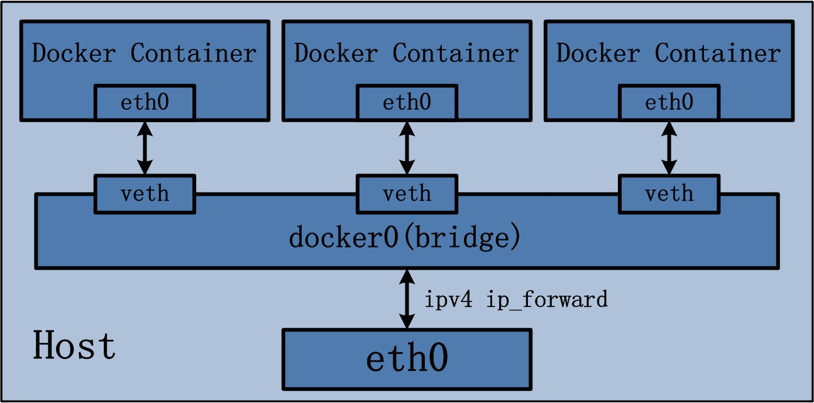
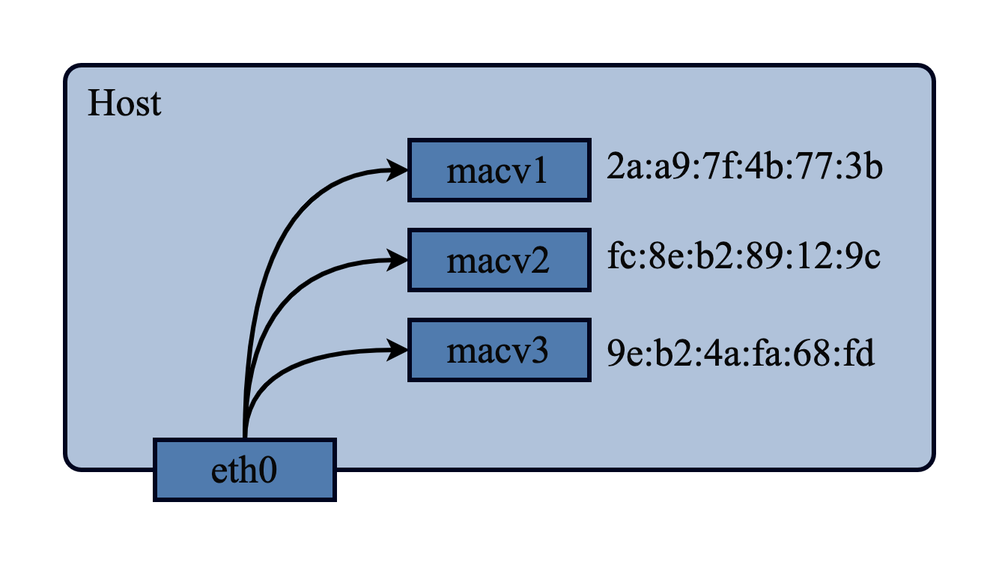
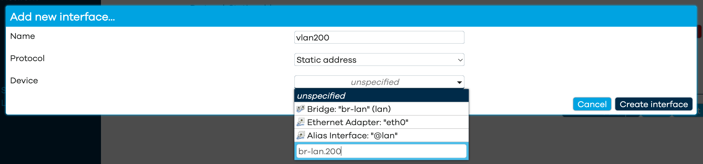
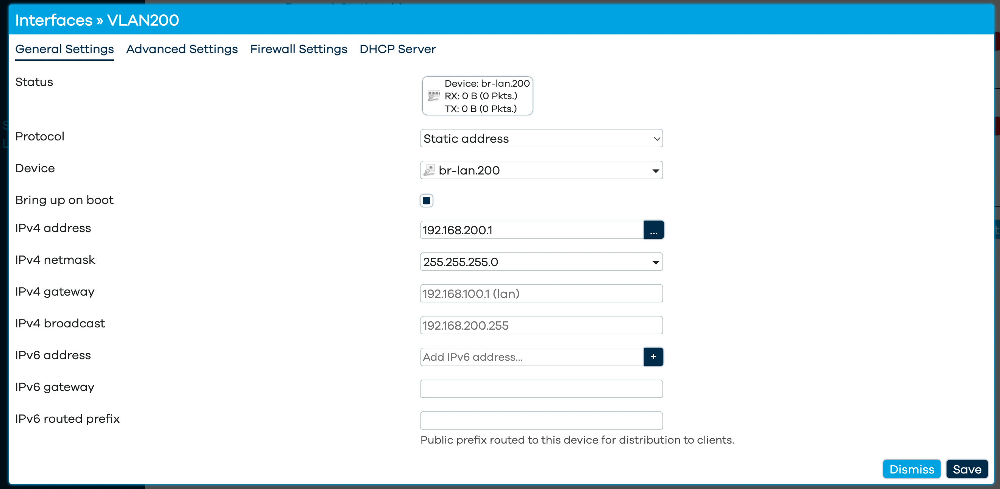

>> 💡 网上有很多关于 k8s 偏平化网络建设的文章，大多针对于大规律的集群。但是现在也有很多人在 NAS 或者家庭服务器中也会使用 Docker 部署服务，本文主要介绍如何使用 Docker  构建扁平化的网络，提供容器的跨主机互访能力。

随着 2013 年 Docker 的发布，容器技术开始走进了各大互联网公司。容器技术不仅仅服务于互联网公司的线上业务，同时也为开发人员搭建测试环境、三方依赖服务等提供了极大的便利。除了在企业中的应用，容器凭借着无依赖一键启动的优势也被越来越多的人用于在家庭 NAS 或者家庭服务器中部署服务，基本上属于必备软件。

家庭 NAS 或者家庭服务器中使用容器多使用 Docker 提供的 Bridge 网络，通过端口转发的方式将通过容器部署的服务暴露到局域网中，其主要实现方式如下:



可以简单将 docker0 理解为一个 switch，container 通过 veth-pair 连接到这个 switch，host 通过 docker0 这个 interface 连接这这个 switch，container 发出的数据包经过 host 进行 NAT 后从主机的 eth0 端口流出。

>> 💡 如果这里将 eth0 直接加到这个 bridge 中来实现也可以使用偏平化的网络，但是 Docker 没有提供这这样的功能，借用 cni 中的 bridge 插件实现 [https://www.cni.dev/plugins/current/main/bridge/](https://www.cni.dev/plugins/current/main/bridge/)


使用 Bridge 网络时由于经过了一层 NAT 转发，容器有自己的私有网段。在其他主机上访问容器服务只能通过端口转发的方式访问。那么有没有办法让容器在我们的局域网中用于“一席之地”（独立IP）呢？实际可行的方式有很多，这里主要介绍一下最简单的 macvlan 模式

### macvlan

macvlan 顾名思义就是一种基于 mac 地址的区分 vlan 的方式。普通的 802.1Q 的 vlan 通过在 frame（帧） 中添加特定 802.1Q tag 的方式实现在单个物理 interface  的基础上建立多个虚拟 interface，通过 tag 区分各个接口的流量。macvlan 的也可以在单个物理的 interface 上建立多个虚拟 interface 不过是通过 mac 地址区分流量



macvlan 中的子 interface 直接的相互通信，可以设置三种模式

- Private: 子 interface 之间不允许相关通信，完全隔离
- VEPA: 子 interface 之间的相互通信需要由外部交换机或路由处理
- Bridge: 子 interface 之间可以相互通信，**docker 中创建的 macvlan 网络只能使用 bridge 模式**

详细可以参考 [https://developers.redhat.com/blog/2018/10/22/introduction-to-linux-interfaces-for-virtual-networking#macvlan](https://developers.redhat.com/blog/2018/10/22/introduction-to-linux-interfaces-for-virtual-networking#macvlan)

### Docker 中使用 macvlan

**创建 macvlan 网络**

在 Docker 中创建 macvlan 十分简单，以我当前的网络环境为例在 enp3s0 interface 下创建 macvlan 网络

```protobuf
2: enp3s0: <BROADCAST,MULTICAST,UP,LOWER_UP> mtu 1500 qdisc fq_codel state UP group default qlen 1000
    link/ether a8:a1:59:24:d0:61 brd ff:ff:ff:ff:ff:ff
    inet 192.168.88.9/24 metric 1024 brd 192.168.88.255 scope global dynamic enp3s0
       valid_lft 551sec preferred_lft 551sec
    inet6 fe80::aaa1:59ff:fe24:d061/64 scope link
       valid_lft forever preferred_lft forever
```

enp3s0 所在的网段为 192.168.88.0/24

```protobuf
docker network create \
	-d macvlan \
	--subnet=192.168.88.0/24 \
	--ip-range=192.168.88.192/27 \
	--gateway 192.168.88.1 \
	-o parent=enp3s0 \
	--aux-address 'host=192.168.88.192' \
	macvlan1
```

**subnet**

子网网段，这里与接口网段一致即可

**ip-range**

容器可用的 IP 范围 ，由于容器并不会使用 dhcp 获取 IP 地址，所以指定的 ip-range 应该与路由器中的 dhcp IP 范围错开，例如我这里的 dhcp 服务器只会分配 192.168.88.64-192.168.88.127 共 64 个 IP，这里让容器使用 192.168.88.192-192.168.88.192.223

**gateway**

网关地址，与接口网段一致即可

**aux-address**

辅助地址，相当于保留地址，分配IP地址时会避开相关 IP

使用 docker network ls 即可查看已经创建的网络

```
docker network ls
NETWORK ID     NAME       DRIVER    SCOPE
fbe90109e5f2   bridge     bridge    local
9186dabfe83e   host       host      local
a373956bfe01   macvlan1   macvlan   local
47312fa573ea   none       null      local
```

**使用 macvlan 创建容器**

创建好 macvlan 网络后即可使用 macvlan 网络创建容器，使用 `—-network` 指定网络

```bash
docker run --network macvlan1 -it --rm alpine sh
```

```bash
/ # ip addr
1: lo: <LOOPBACK,UP,LOWER_UP> mtu 65536 qdisc noqueue state UNKNOWN qlen 1000
    link/loopback 00:00:00:00:00:00 brd 00:00:00:00:00:00
    inet 127.0.0.1/8 scope host lo
       valid_lft forever preferred_lft forever
23: eth0@if2: <BROADCAST,MULTICAST,UP,LOWER_UP,M-DOWN> mtu 1500 qdisc noqueue state UP
    link/ether 02:42:c0:a8:58:c1 brd ff:ff:ff:ff:ff:ff
    inet 192.168.88.193/24 brd 192.168.88.255 scope global eth0
       valid_lft forever preferred_lft forever
```

这时容器已经获取了一个独立的局域网 IP，相当于局域网内的一台独立机器。可以在局域网内的其他机器中直接访问

```bash
λ ~ ping 192.168.88.193
PING 192.168.88.193 (192.168.88.193): 56 data bytes
64 bytes from 192.168.88.193: icmp_seq=0 ttl=64 time=1.739 ms
64 bytes from 192.168.88.193: icmp_seq=1 ttl=64 time=0.743 ms
^C
--- 192.168.88.193 ping statistics ---
2 packets transmitted, 2 packets received, 0.0% packet loss
round-trip min/avg/max/stddev = 0.743/1.241/1.739/0.498 ms
```

**但是这时并没有办法在当前宿主机（即容器所在的机器）上访问容器**，这是因为宿主机上发出的数据包会直接经过物理接口 enp3s0 流出而不会进行 macvlan 内部的 bridge，到达外部网络设备后除非外部的交换机或者路由器支持 [hairpin mode](https://en.wikipedia.org/wiki/Hairpinning) 否则无法进行访问。所以我们需要给宿主机添加一个 macvlan 的 interface 用于访问容器

```bash
# 创建一个 bridge 模式的 macvlan interface docker-link
ip link add docker-link link enp3s0 type macvlan mode bridge
# 设置 docker-link 地址，使用 aux-address 中保留的 IP 地址
ip addr add 192.168.88.192/27 brd + dev docker-link
# 启用 docker-link 接口
ip link set docker-link up
# 添加路由 将 192.168.88.192/27 网段流量指向 docker-link 接口
ip route add 192.168.88.192/27 dev docker-link
```

此时我们就可以在宿主机中顺利访问容器

```bash
tomwei7@my-lab-a300 λ ~ ping 192.168.88.193
PING 192.168.88.193 (192.168.88.193) 56(84) bytes of data.
64 bytes from 192.168.88.193: icmp_seq=1 ttl=64 time=0.038 ms
64 bytes from 192.168.88.193: icmp_seq=2 ttl=64 time=0.070 ms
^C
--- 192.168.88.193 ping statistics ---
2 packets transmitted, 2 received, 0% packet loss, time 1005ms
rtt min/avg/max/mdev = 0.038/0.054/0.070/0.016 ms
```

### macvlan 配合 802.1q VLAN

macvlan 的父接口不一定要是物理接口，也可以是 vlan 接口，这里 Docker 做了一点点语法糖如果父接口中包含 . 则会创建对应的 vlan 接口，例如创建如下 macvlan 网络，

- vlan id 200
- 网段 192.168.200.0/24
- 网关 192.168.200.1

```bash
docker network create \
	-d macvlan \
	--subnet=192.168.200.0/24 \
	--ip-range=192.168.200.0/24 \
	--gateway 192.168.200.1 \
	-o parent=enp3s0.200 \
	macvlan2
```

docker 会自动创建对应的 vlan interface

```bash
ip -details link show

26: enp3s0.200@enp3s0: <BROADCAST,MULTICAST,UP,LOWER_UP> mtu 1500 qdisc noqueue state UP mode DEFAULT group default
    link/ether a8:a1:59:24:d0:61 brd ff:ff:ff:ff:ff:ff promiscuity 0 minmtu 0 maxmtu 65535
    vlan protocol 802.1Q id 200 <REORDER_HDR> addrgenmode eui64 numtxqueues 1 numrxqueues 1 gso_max_size 64000 gso_max_segs 64
```

使用 vlan 还需要在路由器中进行对应的配置以及防火墙规则，

以当前网络使用的 RouterOS 为例需要添加 vlan interface 以及为对应 interface 设置 IP

```
# main-bridge 为当前机器连接的接口所在 bridge 也可以直接设置在端口上
/interface/vlan/add interface=main-bridge vlan-id=200 name=vlan-200-docker-demo
/ip/address/add address=192.168.200.1/24 interface=vlan-200-docker-demo
```

可能大部分人的路由器系统是 openwrt，openwrt 环境下则可以直接通过 UI 操作，在 Network /  interface 下添加新的 interface。protocol 选择 static address，device 选择 custom device 名称格式为 interface.vlanid 比如这里使用 br-lan 接口 vlan 为 200 则 device 名称为 br-lan.200



随后为 interface 设置 IP 即可



>> 💡 如果主机不是直接连接到路由器还存在交换机等还需要进行对应等 vlan 设置这里不做赘述

### 其他

上文主要是以 docker 为例，其他例如 podman 也可以类似的功能。扁平化的容器网络可以让我们的容器在局域网中拥有“姓名” (IP)，相较于 bridge 网络不需要考虑端口够不够用、应该暴露那些端口等等问题，同时也能让宿主机的 iptables 清爽很多。
