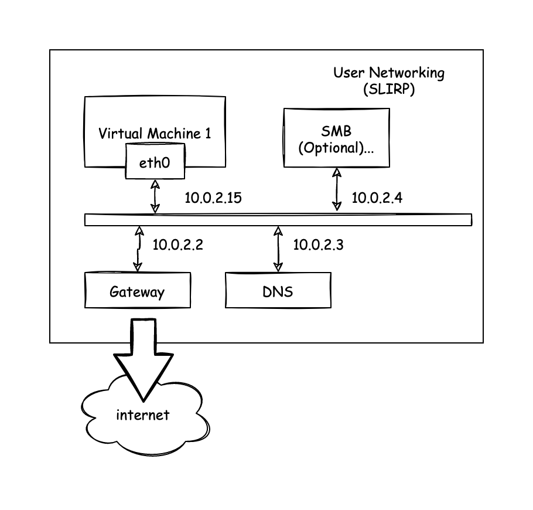
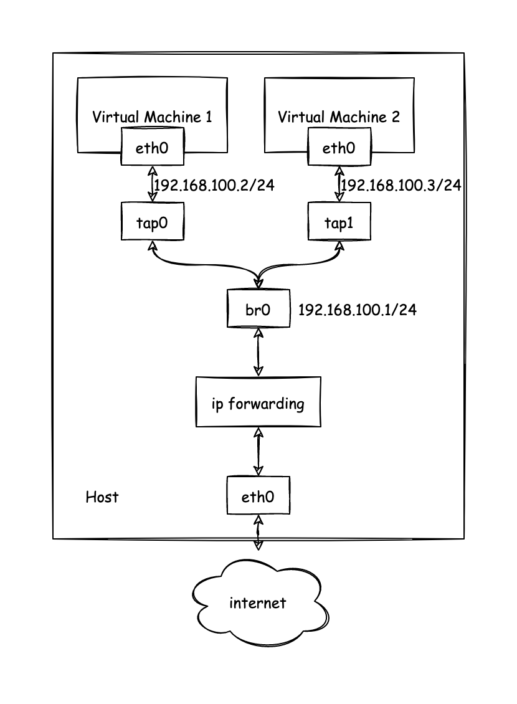
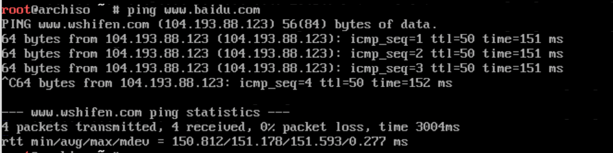
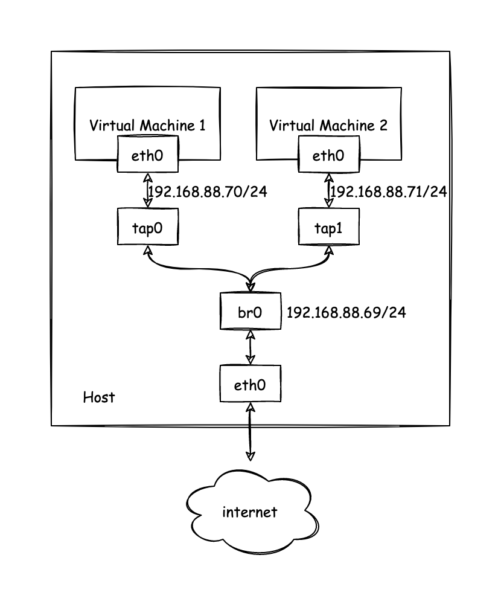

+++
title = "QEMU 网络配置"
date = "2021-10-09"
categories = ["qemu","network"]
image = "Qemu-Network-01.drawio.png"
+++

QEMU 是一款开源的通用模拟器被用于各式各样的虚拟化场景。QEMU 不同于我们常用的 [VirtualBox](https://www.virtualbox.org/) 或者 [VMware](https://www.vmware.com/) 之类的软件，QEMU 并没有提供图形化的配置工具，一般都是使用命令行进行使用。其中最复杂的要属网络的配置，要理解 QEMU 的网络配置实现要了解它网络的组成，QEMU 的网络由两个部分组成:

- 提供给虚拟机的虚拟网卡（virtual network device）比如经典的 e1000,rtl8139 以及 virtio-net-pci 等，是虚拟机内部看到的设备
- 与虚拟网卡交互的后端（network backend）虚拟机往虚拟网卡写入的数据都会由 network backend 流出到真实的网络环境中

网络配置参数:

QEMU 网络配置需要组合使用 `-netdev TYPE,id=NAME,...` 与 `-device device TYPE,netdev=NAME` 命令，`-device` 用于配置虚拟网卡，`-netdev` 用于配置网络后端，`netdev` 中的 `id` 与 `device` 中的 `netdev` 参数配合用于组成一组网络配置，一台虚拟机可以配置多个网络

比如最简单的使用 User Networking 的配置

```bash
-netdev user,id=mynic0 -device e1000,netdev=mynic0,mac=52:54:98:76:54:32
```

如果不关心网卡的详细配置也可以使用 `-nic` 简化命令

```bash
-nic user,model=e1000,mac=52:54:98:76:54:32
```

`-nic` 参数中 model 对应 device 中的 type，使用 nic 可以避免分别配置 netdev 与 device 但是相对的只提供了非常少的可选参数

> QEMU 不会为网卡生成随机的 mac 地址，如果不指定 mac 地址则启动的虚拟机都有相同的 mac 如果需要启动多个虚拟机在除 User Networking 的网络比如 tap 的桥接网络中都会存在 mac 地址冲突问题。
>

### Network Backend

---

常用的 Network Backend 主要有两种 user networking(slirp) 和 [tap](https://en.wikipedia.org/wiki/Network_tap#:~:text=A%20network%20tap%20is%20a,two%20points%20in%20the%20network.) ，大多数情况下如果你只是希望你的虚拟机能够访问网络那么 user networking(slirp) 就够用了，user networking(slirp) 也是 QEMU 的默认项。但是如果希望组建比较复杂的网络拓扑或者希望虚拟机宿主机之间能够自由的相互访问这个时候 [tap](https://en.wikipedia.org/wiki/Network_tap#:~:text=A%20network%20tap%20is%20a,two%20points%20in%20the%20network.) 就很适合。

### User Networking (SLIRP)

这是 QEMU 的默认 Network Backend，使用时不需要管理员（root）权限，但是存在这以下限制

- 由于额外开销比较大，所以性能比较差
- 不特殊配置无法传输 ICMP 流量比如不能使用 ping 等
- 虚拟机默认没办法直接从宿主机或者外部网络访问

User Networking 使用 SLIRP 实现，SLIRP 实现了完整的 TCP/IP 栈并以此实现了虚拟的 NAT 转发，供虚拟机访问网络

当不带任何网络参数启动虚拟机时，默认的网络拓扑如上图



User Networking 可以添加参数其他参数实现类似端口转发，通过 SMB 共享主机文件夹等

- 端口转发 `-netdev user,id=n0,hostfwd=hostip:hostport-guestip:guestport`
- SMB目录共享 `-netdev user,id=n0,smb=dir,smbserver=addr`

### TAP Network

[TUN/TAP设备](https://zh.wikipedia.org/wiki/TUN%E4%B8%8ETAP)是一种 Linux 上的虚拟网络设备，通过此设备，程序可以方便的模拟网络行为，其中 TAP 模拟的是个二层设备可以通过 TAP 设备收发 MAC 层数据包，即数据链路层，拥有 MAC 层功能，可以与物理网络做 Bridge。TUN 则是个三层设备可以用于收发 IP 层数据包，这里不做过多讨论。TAP Network 就是使用宿主机 TAP 设备作为 Network Backend 的一种网络模式，一般会和 Bridge 配合使用提供了很好的网络性能，而且拥有极大的灵活性，可以实现各种各样的网络拓扑。不过这种网络一般需要root权限才能使用。

TAP Network 一般需要配置 Bridge 使用，这里主要介绍两种网络模式，NAT 和 桥接物理网络。

首先需要创建一个 bridge 可以使用 IP 命令添加一个 bridge

```bash
ip link add name br0 type bridge
```

使用 TAP Network 配合 Bridge 实现的 NAT 网络拓扑如下，这种网络模式是我个人比较喜欢的方式，在该网络中，虚拟机拥有自己的 IP 宿主机可以直接访问虚拟机，虚拟机也能够直接访问宿主机。虚拟机访问外网时宿主机充当网关，实现 NAT 功能。物理网络中其他主机无法直接访问该虚拟机，不过可以在宿主机上使用 iptables 配置端口转发实现暴露虚拟机到物理网络。



在这之前需要做些准备工作，首先我们为之前创建的 bridge 配置 IP 地址，并启动 bridge。然后需要配置 Linux ip forwarding 以及 NAT 功能

```bash
ip addr add 192.168.100.1/24 brd + dev br0
ip link set br0 up
# 开启 ip_forward
sysctl -w net.ipv4.ip_forward=1
# 允许对从 br0 流入的数据包进行 FORWARD
iptables -t filter -A FORWARD -i br0 -j ACCEPT
iptables -t filter -A FORWARD -o br0 -j ACCEPT
# 也可以直接将 filter FORWARD 策略直接设置为 ACCEPT
# iptables -t filter -P FORWARD ACCEPT
# 开启 NAT
iptables -t nat -A POSTROUTING -o enp4s0 -j MASQUERADE
```

现在我们就可以使用 br0 实现 NAT 网络了，这里我们启动一个简单的 archlinux 的 live cd 作为测试

```bash
# 启动虚拟机
qemu-system-x86_64 -enable-kvm -m 2048 -boot order=d -cdrom archlinux-2021.10.01-x86_64.iso -nic bridge,br=br0,model=virtio-net-pci,mac=02:76:7d:d7:1e:3f
# 进入虚拟机后配置网卡
ip addr add 192.168.100.2/24 brd + dev ens3
ip route add default via 192.168.100.1 dev ens3
# 按需修改 /etc/resolv.conf 配置 DNS 服务器
```

测速网站测试下网络联通性



使用 TAP 配合 Bridge 也可以实现桥接物理，网络的拓扑如下，这个网络模式下，虚拟机作为和宿主机对等的关系接入物理网络。虚拟机，宿主机与网络中的其他主机均可相互访问。



这个模式与上面的 NAT 模式比较类似，不过不需要对宿主机进行特别的配置，只需要将物理机网卡加入 br0 中即可，这个时候 br0 相当于一个交换机，宿主机和虚拟机都连在这个交换机上。使用 `ip link set eth0 master bridge_name` 可以将物理网卡加入 bridge 中。

### Virtual Network Device

---

虚拟网络设备，对于的就是虚拟机内实际看到的网卡设备，一般根据虚拟机操作系统的类型选择或者你希望模拟的设备选择。如果你希望模拟一个嵌入式设备带有一个板载网卡，那么你可以选择一个板载网卡网卡的设备，可以使用 `-device help` 列出所有支持的设备类型。

```bash
Network devices:
name "e1000", bus PCI, alias "e1000-82540em", desc "Intel Gigabit Ethernet"
name "e1000-82544gc", bus PCI, desc "Intel Gigabit Ethernet"
name "e1000-82545em", bus PCI, desc "Intel Gigabit Ethernet"
name "e1000e", bus PCI, desc "Intel 82574L GbE Controller"
name "i82550", bus PCI, desc "Intel i82550 Ethernet"
name "i82551", bus PCI, desc "Intel i82551 Ethernet"
name "i82557a", bus PCI, desc "Intel i82557A Ethernet"
name "i82557b", bus PCI, desc "Intel i82557B Ethernet"
name "i82557c", bus PCI, desc "Intel i82557C Ethernet"
name "i82558a", bus PCI, desc "Intel i82558A Ethernet"
name "i82558b", bus PCI, desc "Intel i82558B Ethernet"
name "i82559a", bus PCI, desc "Intel i82559A Ethernet"
name "i82559b", bus PCI, desc "Intel i82559B Ethernet"
name "i82559c", bus PCI, desc "Intel i82559C Ethernet"
name "i82559er", bus PCI, desc "Intel i82559ER Ethernet"
name "i82562", bus PCI, desc "Intel i82562 Ethernet"
name "i82801", bus PCI, desc "Intel i82801 Ethernet"
name "ne2k_isa", bus ISA
name "ne2k_pci", bus PCI
name "pcnet", bus PCI
name "rocker", bus PCI, desc "Rocker Switch"
name "rtl8139", bus PCI
name "tulip", bus PCI
name "usb-net", bus usb-bus
name "virtio-net-device", bus virtio-bus
name "virtio-net-pci", bus PCI, alias "virtio-net"
name "virtio-net-pci-non-transitional", bus PCI
name "virtio-net-pci-transitional", bus PCI
name "vmxnet3", bus PCI, desc "VMWare Paravirtualized Ethernet v3"
```

对于 Linux 虚拟机没有特殊要求，我们可以使用半虚拟化的设备 `virtio` 来获得最好的性能。
