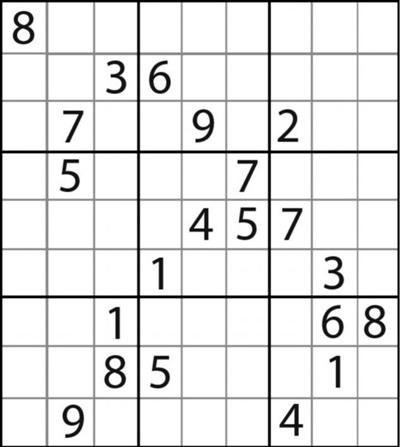
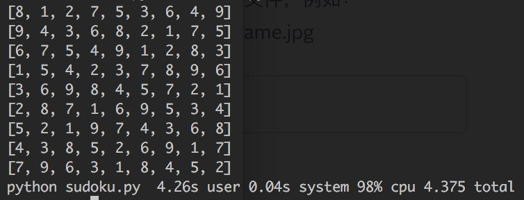

+++
title = "一种回溯的解数独算法"
date = "2016-08-21"
description = "数独是一种逻辑性的数字填充游戏，玩家须以数字填进每一格，而每行、每列和每个宫（即3x3的大格）有齐1至9所有数字。游戏设计者会提供一部分的数字，使谜题只有一个答案。"
categories = ["algorithms", "python"]
image = "Sudoku-by-L2G-20050714.svg"
+++

数独是一种逻辑性的数字填充游戏，玩家须以数字填进每一格，而每行、每列和每个宫（即3x3的大格）有齐1至9所有数字。游戏设计者会提供一部分的数字，使谜题只有一个答案。


<!--more-->

### 算法步骤

* 1、扫描整个9x9宫格，根据已有的数字找出每一个空格能够填充的所有数字，若出现某一个空格没有能够填充的数字，则进行回溯。
* 2、选择拥有最少能够填充数字的空格，从能够填充的数字中选取一个数填入该空格，将填入的空格位置和剩余的能够填充的数字压入历史堆栈
* 3、重复1直至所有空格均被填充，则完成

回溯操作

* 1、从历史堆栈弹出一个元素，若堆栈为空，则该数独无解。
* 2、若弹出的元素的剩余可填充数字个数为0，则将该元素所纪录的空格从宫格中删除，重复1，否则，从剩余的可填充数字中选取一个重新填入该空格。

### 代码实现

```python
class Sudoku(object):
    """
    Sudoku solver
    """

    def __init__(self, matrix):
        self.matrix = matrix
        self.history_stack = []

    def _push_history(self, pos, val_list):
        self.history_stack.append([pos] + val_list)

    def _pop_history(self):
        if len(self.history_stack) > 0:
            if len(self.history_stack[-1]) > 1:
                self._set_pos(self.history_stack[-1][0],
                              self.history_stack[-1].pop())
            else:
                tem = self.history_stack.pop()
                self._set_pos(tem[0], 0)
                self._pop_history()
        else:
            raise Exception("out of history_stack")

    def _set_pos(self, pos, val):
        self.matrix[pos // 9][pos % 9] = val

    def _get_pos(self, pos):
        return self.matrix[pos // 9][pos % 9]

    def _get_available(self, pos):
        ret = [1, 2, 3, 4, 5, 6, 7, 8, 9]
        s_x = (pos // 9) * 9
        for i in range(s_x, s_x+9):
            if i == pos:
                continue
            val = self._get_pos(i)
            if val != 0 and val in ret:
                ret.remove(val)
        s_y = pos % 9
        for i in range(s_y, 81, 9):
            if i == pos:
                continue
            val = self._get_pos(i)
            if val != 0 and val in ret:
                ret.remove(val)
        box_y = pos // 27
        box_x = (pos % 9) // 3
        box_start = 27 * box_y + 3 * box_x
        for i in range(box_start, box_start+21, 9):
            for j in range(i, i+3):
                if j == pos:
                    continue
                val = self._get_pos(j)
                if val != 0 and val in ret:
                    ret.remove(val)
        return ret

    def _pos_to_xy(self, pos):
        return pos // 9, pos % 9

    def _find_enter(self):
        enter = -1
        available_list = []
        for i in range(81):
            val = self._get_pos(i)
            if val != 0:
                continue
            tem_list = self._get_available(i)
            if len(tem_list) == 0:
                raise Exception("matrix error trace back")
            if enter == -1 or len(tem_list) < len(available_list):
                enter = i
                available_list = tem_list
        return enter, available_list

    def display(self):
        for line in self.matrix:
            print(line)

    def solver(self):
        while 1:
            try:
                enter, available_list = self._find_enter()
            except Exception:
                self._pop_history()
                continue
            if enter == -1:
                return self.matrix
            self._set_pos(enter, available_list.pop())
            self._push_history(enter, available_list)
```

### 测试

测试我用了所谓的[芬兰数学家因卡拉花费3个月设计出了世界上迄今难度最大的九宫格游戏](http://www.guokr.com/post/258813/focus/0735702793/)





实际用时四秒左右，应该很有很大的优化空间

